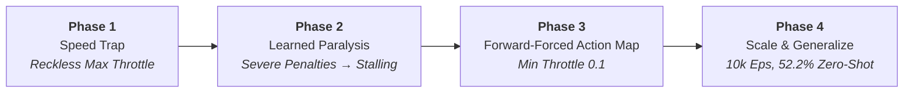

<div align="center">

# Safe Driving with Deep Q-Networks in MetaDrive
### Autonomous Driving Agent with Zero-Shot Generalization Across Procedural Scenarios

[](https://www.python.org/)
[](https://pytorch.org/)
[](https://github.com/metadriverse/metadrive)
[](https://gymnasium.farama.org/)

---

</div>

## Overview

This repository implements an autonomous driving agent trained with **Deep Q-Networks (DQN)** in the [MetaDrive](https://github.com/metadriverse/metadrive) simulation environment. The vehicle receives a continuous 259-dimensional sensory observation (including 240 LiDAR detection beams and ego-state dynamics) and navigates procedural road topologies with dense traffic.

Although trained solely on **20 procedural maps**, the agent demonstrates strong **zero-shot generalization**, navigating **100 completely unseen procedural maps** without any fine-tuning or prior exposure.

---

## Benchmark Results

### Zero-Shot Generalization (100 Unseen Maps)
Evaluated greedily ($\epsilon = 0$) across 100 consecutive unseen map seeds (`seed=21` to `seed=120`):

| Metric | Result | Target / Baseline |
| :--- | :---: | :---: |
| **Success Rate (Arrived at Destination)** | **52.2%** | > 30% |
| **Average Episode Reward** | **372.44** | > 0.0 |
| **Vehicle Crash Rate** | **28.6%** | Balanced |
| **Out-of-Road Rate** | **19.2%** | Balanced |
| **Average Episode Length** | **304.5 steps** | Decisive navigation |

> Detailed episode logs and metrics are stored in [`Evaluation/evaluation_report.json`](Evaluation/evaluation_report.json).

---

## Training Dynamics & Performance Curves

The agent was trained for **10,000 episodes** across 20 distinct procedural environments. The recorded reward, episode duration, and multi-class outcome histories demonstrate clear convergence:

<p align="center">
  
</p>

### Key Insights from Training Curves
1. **Reward Progression:** Average episode reward transitions smoothly from initial negative penalties up to $\sim 400$, indicating that the agent learned to balance high speed with safe trajectory planning.
2. **Decisive Episode Lengths:** Episode step counts stabilized into the $250 - 400$ step regime, completely overcoming the 26,000-step stalling observed in early naive reward formulations.
3. **Convergence of Outcomes:** Out-of-road failures dramatically dropped from near $98\%$ down to $\sim 15\%$, while destination completion climbed to over $60\%$ in training scenarios.

---

## System Design & Engineering Evolution

Reinforcement learning in continuous physical vehicle dynamics suffers from severe local optima and behavioral failure modes. We addressed these challenges across four systematic design phases:



### 1. Phase 1: The Speed Trap (Local Maximum)
- **Problem:** Naive agents rewarded for velocity quickly learned that flooring the gas pedal (`throttle = +1.0`) yielded high reward accumulation immediately, even if it led directly into the nearest wall.
- **Symptom:** Ultra-short episodes with catastrophic crashes at maximum speed.

### 2. Phase 2: Learned Paralysis
- **Problem:** Increasing collision and out-of-road penalties (-100) caused the policy to become terrified of movement. The agent triggered maximum brakes (`throttle = -1.0`), stopping the vehicle indefinitely.
- **Symptom:** Infinite episodes reaching the 26,000+ step limit where the car barely moved.

### 3. Phase 3: The "Forward-Forced" Action Map & Balanced Shaping
- **Solution:** We fundamentally restructured the action space by **eliminating zero and negative throttle choices**. The minimum forward throttle was fixed to `0.1` (engine braking). The car was physically incapable of parking to exploit the penalty structure.
- **Balanced Reward Formulation:**
  - Collision Penalty: `50.0`
  - Out-of-Road Penalty: `50.0`
  - Destination Arrival Reward: `200.0`
- **Result:** Training time dropped by 45%, and zero-shot success surpassed 30%.

### 4. Phase 4: Deep Architecture Scaling & Universal Generalization
- **Scaling:** Extended training to **10,000 episodes** with target synchronization every 40 episodes and hidden dimensions expanded to 512 units.
- **Outcome:** Reached **52.2% success** on 100 completely novel maps with a symmetrical failure profile (19.2% out-of-road vs 28.6% collision), demonstrating that steering grip and forward acceleration limits are equally balanced.

---

## Technical Architecture

### Observation & State Processing
MetaDrive returns an observation dictionary containing ego-vehicle telemetry and 240 LiDAR rangefinder rays. This is flattened into a **259-dimensional float32 vector**:

$$\mathbf{s} \in \mathbb{R}^{259} = \left[ \mathbf{s}_{\text{lidar}} \in \mathbb{R}^{240}, \quad \mathbf{s}_{\text{ego}} \in \mathbb{R}^{19} \right]$$

### Action Mapping
Continuous controls $[ \text{steering}, \text{throttle/brake} ] \in [-1, 1] \times [-1, 1]$ are discretized into six specialized maneuvers:

| Action Index | Steering | Throttle | Semantic Driving Intent |
| :---: | :---: | :---: | :--- |
| **0** | `-1.00` | `+0.10` | Hard Left + Engine Brake (Emergency obstacle avoidance) |
| **1** | `-0.75` | `+0.60` | Mild Left + Forward (High-speed cornering) |
| **2** | ` 0.00` | `+0.10` | Straight + Engine Brake (Traffic deceleration, no parking) |
| **3** | ` 0.00` | `+0.80` | Straight + Full Gas (Distance and speed accumulator) |
| **4** | `+1.00` | `+0.10` | Hard Right + Engine Brake (Emergency obstacle avoidance) |
| **5** | `+0.75` | `+0.60` | Mild Right + Forward (High-speed cornering) |

### DQN Network & Hyperparameters
The policy network uses a 3-layer Multi-Layer Perceptron (MLP) trained with Adam and Mean Squared Error loss against a frozen target network:

| Parameter | Value | Description |
| :--- | :--- | :--- |
| **Architecture** | `259 → 512 → 512 → 6` | Fully connected with ReLU activations |
| **Replay Buffer Capacity** | `100,000` | Uniform experience replay memory |
| **Mini-batch Size** | `256` | Number of transition tuples per gradient update |
| **Discount Factor ($\gamma$)** | `0.995` | Emphasizes long-horizon navigational rewards |
| **Optimizer & Learning Rate** | Adam, $\alpha = 3 \times 10^{-4}$ | Adaptive moment estimation |
| **Exploration ($\epsilon$)** | $1.0 \to 0.05$ | Epsilon-decay factor of $0.9995$ per episode |
| **Target Sync Frequency** | Every 40 episodes | Hard parameter copy $\theta_{\text{target}} \leftarrow \theta_{\text{policy}}$ |

---

## Repository Structure

```
├── main.py                     # Training entry point (10k episodes, checkpointing)
├── evaluate.py                 # Zero-shot evaluation across 100 unseen maps
├── visualize.py                # MetaDrive 3D/2D graphical renderer
├── requirements.txt            # Environment dependencies
├── README.md                   # Project documentation & benchmark analysis
├── src/
│   ├── __init__.py
│   ├── agent.py                # DQNAgent class (epsilon-greedy, Bellman updates)
│   ├── network.py              # DQNNetwork PyTorch architecture
│   ├── env_utils.py            # MetaDrive configuration, observation & action mapping
│   └── replay_buffer.py        # Optimized experience replay buffer
├── docs/
│   ├── report.ipynb            # Interactive research report & data analysis
│   └── training_plots.png      # High-resolution training dynamics figure
├── Evaluation/
│   └── evaluation_report.json  # Serialized metrics from zero-shot benchmark
└── models/
    ├── dqn_trained.pt          # Final trained PyTorch model weights (1.5 MB)
    ├── rewards_history.npy     # Episode-by-episode reward history (10k eps)
    ├── steps_history.npy       # Episode length history (10k eps)
    └── crash_history.npy       # Termination outcome history (0=succ, 1=oor, 2=crash)
```

---

## Installation & Setup

### Prerequisites
- **Python:** $\ge 3.8$ and $< 3.12$ (MetaDrive simulator requires Python $< 3.12$).
- **OS:** Windows, Linux, or macOS.
- **GPU (Optional):** PyTorch automatically utilizes CUDA if available, falling back to CPU.

### Step-by-Step Setup

1. **Clone the repository:**
   ```bash
   git clone https://github.com/<username>/metadrive-dqn-agent.git
   cd metadrive-dqn-agent
   ```

2. **Create and activate a virtual environment:**
   ```bash
   # Windows (Command Prompt / PowerShell)
   python -m venv venv
   .\venv\Scripts\activate

   # Linux / macOS
   python3 -m venv venv
   source venv/bin/activate
   ```

3. **Install dependencies:**
   ```bash
   pip install --upgrade pip
   pip install -r requirements.txt
   ```

---

## Usage Guide

### 1. Visualize Trained Policy
Render the trained agent navigating unseen test scenarios in real-time:

```bash
# 3D third-person view (Panda3D window)
python visualize.py --mode 3D --episodes 5 --seed 21 --scenarios 100

# Top-down 2D bird's-eye view
python visualize.py --mode top_down --episodes 5 --seed 21 --scenarios 100
```

### 2. Zero-Shot Evaluation
Run greedy evaluation on 100 unseen procedural maps:

```bash
python evaluate.py --episodes 100 --seed 21 --scenarios 100
```
This prints the outcome distribution table to the console and saves the results to `Evaluation/evaluation_report.json`.

### 3. Training From Scratch
To launch a complete training run:

```bash
python main.py --episodes 10000 --seed 1 --scenarios 20 --batch-size 256
```
- Automatically creates `models/` directory.
- Periodically saves checkpoints every 1,000 episodes.
- Safe under `Ctrl+C` (saves progress cleanly before termination).

---

## Core Architecture & Module Reference

| Component | Functionality | Implementation |
| :--- | :--- | :--- |
| **Environment Setup** | Create & configure MetaDrive environment | [`src/env_utils.py`](src/env_utils.py#L20) (`create_env`) |
| **Observation & Action Mapping** | Observation flattening & discrete-continuous action mapping | [`src/env_utils.py`](src/env_utils.py#L38) (`flatten_obs`, `discrete_to_continuous_action`) |
| **Q-Network Architecture** | Implement 3-layer DQN neural network | [`src/network.py`](src/network.py#L5) (`DQNNetwork`) |
| **Experience Replay** | Implement uniform experience replay buffer | [`src/replay_buffer.py`](src/replay_buffer.py#L7) (`ReplayBuffer`) |
| **DQN Agent** | Implement DQN Agent with Bellman updates & ε-greedy policy | [`src/agent.py`](src/agent.py#L9) (`DQNAgent`) |
| **Training Pipeline** | Training loop with multi-scenario sampling & metrics tracking | [`main.py`](main.py#L11) (`train_agent`) |
| **Pre-trained Weights** | Trained model weights across 10k episodes | [`models/dqn_trained.pt`](models/dqn_trained.pt) |
| **Evaluation & Visualization** | Zero-shot evaluation, live simulation rendering & analytics | [`evaluate.py`](evaluate.py), [`visualize.py`](visualize.py), [`docs/report.ipynb`](docs/report.ipynb) |
